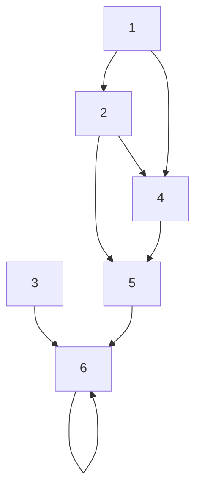

# OCR Result: graph_presentation

Source: `src/experiments/document_processing/test_data/2_2-GraphPresentation.pdf`

## Segment 1

Discrete Mathematics

## Segment 1

### Visual Element (Page 1, Image 0)
Here's a markdown representation of the image, describing its content:

```markdown
# SOICT 25th Anniversary

  *(Replace `image_url` with the actual URL of the image if you're using this in a markdown editor that supports images)*

**Text:**

*   **Logo:** A logo featuring "25 YEARS" and "SOICT" in a stylized design.  The logo also includes the text "ĐẠI HỌC BÁCH KHOA HÀ NỘI" (Hanoi University of Science and Technology) and "VIỆN CÔNG NGHỆ THÔNG TIN VÀ TRUYỀN THÔNG" (Institute of Information and Communication Technology).
*   **Background:** A solid red background with a halftone dot pattern, creating a textured effect.

**Overall:**

The image is a commemorative design celebrating the 25th anniversary of the SOICT (Institute of Information and Communication Technology) at Hanoi University of Science and Technology. It's a visually simple design, relying on color and the logo to convey its message.
```

**Explanation of the Markdown:**

*   `# SOICT 25th Anniversary`:  Creates a level 1 heading.
*   ``:  This is the markdown syntax for an image.  You'll need to replace `image_url` with the actual web address of the image to display it.
*   **Text:** and **Background:**  These are bolded headings to organize the description.
*   Bullet points (`*`) are used to list the key elements.
*   The Vietnamese text is included as it appears in the image.
*   **Overall:** Provides a summary of the image's purpose and style.

**Important Note:**  I can't *display* the image here.  The `` line is a placeholder.  If you're using a markdown editor (like on GitHub, Reddit, or a dedicated markdown app), you'll need to replace `image_url` with the actual URL of the image to see it.

## Segment 2

2
PART 1
COMBINATORIAL THEORY    
(Lý thuyết tổhợp)
PART 2
GRAPH THEORY
(Lý thuyết đồthị)

## Segment 2

### Visual Element (Page 2, Image 0)
Here's a markdown representation of the image you sent, describing its content:

The image is a mostly blank page with branding elements at the top and bottom.

**Top:**

*   A logo consisting of a circular emblem with the number "25" inside, and the text "SOICT" below it. The emblem has a gold and green color scheme.

**Bottom:**

*   A logo with the text "VIỆN CÔNG NGHỆ THÔNG TIN VÀ TRUYỀN THÔNG" (Institute of Information and Communication Technology) along with the SOICT logo.

**Overall:**

The page appears to be a title or introductory page from a document produced by the Institute of Information and Communication Technology (SOICT). The large amount of white space suggests it's a deliberate design choice for visual clarity.

## Segment 3

Content of Part 2
Chapter 1. Fundamental concepts
Chapter 2. Graph representation
Chapter 3. Graph Traversal
Chapter 4. Tree and Spanning tree
Chapter 5. Shortest path problem
Chapter 6. Maximum flow problem

## Segment 3

### Visual Element (Page 3, Image 0)
Here's a markdown representation of the image you sent, describing its content:

The image is a mostly blank page with branding elements at the top and bottom.

**Top:**

*   A logo consisting of a circular emblem with the number "25" inside, and the text "SOICT" below it. The emblem has a gold and green color scheme.

**Bottom:**

*   A logo with the text "VIỆN CÔNG NGHỆ THÔNG TIN VÀ TRUYỀN THÔNG" (Institute of Information and Communication Technology) along with the SOICT logo.

**Overall:**

The page appears to be a title or introductory page from a document produced by the Institute of Information and Communication Technology (SOICT). The large amount of white space suggests it's a deliberate design choice for visual clarity.

## Segment 4

Graph Representation
1. Incidence matrix
2. Adjacency matrix
3. Weight matrix
4. Adjacency list
4

## Segment 4

### Visual Element (Page 4, Image 0)
Here's a markdown representation of the image you sent, describing its content:

The image is a mostly blank page with branding elements at the top and bottom.

**Top:**

*   A logo consisting of a circular emblem with the number "25" inside, and the text "SOICT" below it. The emblem has a gold and green color scheme.

**Bottom:**

*   A logo with the text "VIỆN CÔNG NGHỆ THÔNG TIN VÀ TRUYỀN THÔNG" (Institute of Information and Communication Technology) along with the SOICT logo.

**Overall:**

The page appears to be a title or introductory page from a document produced by the Institute of Information and Communication Technology (SOICT). The large amount of white space suggests it's a deliberate design choice for visual clarity.

## Segment 5

Graph Representation
1. Incidence matrix
2. Adjacency matrix
3. Weight matrix
4. Adjacency list
5
NGUYỄN KHÁNH PHƯƠNG
Bộ môn KHMT – ĐHBK HN

## Segment 5

### Visual Element (Page 5, Image 0)
Here's a markdown representation of the image you sent, describing its content:

The image is a mostly blank page with branding elements at the top and bottom.

**Top:**

*   A logo consisting of a circular emblem with the number "25" inside, and the text "SOICT" below it. The emblem has a gold and green color scheme.

**Bottom:**

*   A logo with the text "VIỆN CÔNG NGHỆ THÔNG TIN VÀ TRUYỀN THÔNG" (Institute of Information and Communication Technology) alongside the "SOICT" logo.

**Overall:**

The page appears to be a title or introductory page from a document produced by the Institute of Information and Communication Technology (SOICT). The large amount of white space suggests it's a deliberate design choice for visual clarity.

## Segment 6

1. Incidence Matrix
G = (V, E) is an unditected graph:
• V = {v1, v2, v3, …, vn }
• E = {e1, e2, …, em }
Then the incidence matrix with respect to this ordering of V and E is the n x
m matrix M = [mij], where
Can also be used to represent :
• Multiple edges: by using columns with identical entries, since these edges
are incident with the same pair of vertices
• Loops: by using a column with exactly one entry equal to 1,
corresponding to the vertex that is incident with the loop
î
í
ì
=
otherwise
  
0
ith v
incident w
 
is
 e 
edge
  when 
1
 
  
 
m
i
j
ij
6

## Segment 6

### Visual Element (Page 6, Image 0)
Here's a markdown representation of the image you sent, describing its content:

The image is a mostly blank page with branding elements at the top and bottom.

**Top:**

*   A logo consisting of a circular emblem with the number "25" inside, and the text "SOICT" below it. The emblem has a gold and green color scheme.

**Bottom:**

*   A logo with the text "VIỆN CÔNG NGHỆ THÔNG TIN VÀ TRUYỀN THÔNG" (Institute of Information and Communication Technology) alongside the "SOICT" logo.

**Overall:**

The page appears to be a title or introductory page from a document produced by the Institute of Information and Communication Technology (SOICT). The large amount of white space suggests it's a deliberate design choice for visual clarity.

## Segment 7

1.Incidence Matrix
Matrix M |V| x |E| = [mij], where
Can also be used to represent :
• Multiple edges: by using columns with identical entries, since these edges
are incident with the same pair of vertices
• Loops: by using a column with exactly one entry equal to 1,
corresponding to the vertex that is incident with the loop
î
í
ì
=
otherwise
  
0
ith v
incident w
 
is
 e 
edge
  when 
1
 
  
 
m
i
j
ij
7

## Segment 7

### Visual Element (Page 7, Image 0)
Here's a markdown representation of the image you sent, describing its content:

The image is a mostly blank page with branding elements at the top and bottom.

**Top:**

*   A logo consisting of a circular emblem with the number "25" inside, and the text "SOICT" below it. The emblem has a gold and red color scheme.

**Bottom:**

*   A logo with the text "VIỆN CÔNG NGHỆ THÔNG TIN VÀ TRUYỀN THÔNG" (Institute of Information and Communication Technology) along with the SOICT logo.

**Overall:**

The page appears to be a title or introductory page from a document produced by the Institute of Information and Communication Technology (SOICT), likely celebrating its 25th anniversary. The majority of the page is white space.

## Segment 8

1.Incidence Matrix
Example: G = (V, E)
e1
e2
e3
v
1
0
1
u
1
1
0
w
0
1
1
8
v
w
u
e1
e3
e2

## Segment 8

### Visual Element (Page 8, Image 0)
Here's a markdown representation of the image you sent, describing its content:

The image is a mostly blank page with branding elements at the top and bottom.

**Top:**

*   A logo consisting of a circular emblem with the number "25" inside, and the text "SOICT" below it. The emblem has a yellow background with red and green accents.

**Bottom:**

*   A logo with the text "VIỆN CÔNG NGHỆ THÔNG TIN VÀ TRUYỀN THÔNG" (Institute of Information and Communication Technology) alongside the "SOICT" logo.

**Overall:**

The page appears to be a title or introductory page from a document produced by the Institute of Information and Communication Technology (SOICT). The large amount of white space suggests it's a deliberate design choice for visual clarity.

## Segment 9

Graph Representation
1. Incidence matrix
2. Adjacency matrix
3. Weight matrix
4. Adjacency list
9

## Segment 9

### Visual Element (Page 9, Image 0)
Here's a markdown representation of the image you sent, describing its content:

The image is a mostly blank page with branding elements at the top and bottom.

**Top:**

*   A logo consisting of a circular emblem with the number "25" inside, and the text "SOICT" below it. The emblem has a yellow background with red and green accents.

**Bottom:**

*   A logo with the text "VIỆN CÔNG NGHỆ THÔNG TIN VÀ TRUYỀN THÔNG" (Institute of Information and Communication Technology) alongside the "SOICT" logo.

**Overall:**

The page appears to be a title or introductory page from a document produced by the Institute of Information and Communication Technology (SOICT). The large amount of white space suggests it's a deliberate design choice for visual clarity.

## Segment 10

2. Adjacency Matrix
The Adjacency Matrix (NxN) A = [aij] where |V| = N
For undirected graph
For directed graph
This makes it easier to find subgraphs, and to reverse graphs if needed.
î
í
ì
=
otherwise
  
0
G
 
of
 
edge
an 
 
is
 )
 v
,
(v
 
if
  
1
 
  
 a
j
i
ij
î
í
ì
=
otherwise
  
0
G
 
of
 
edge
an 
 
is
 }
 v
,
{v
 
if
  
1
 
  
 a
j
i
ij
2
1
3
A=
0 1 1
1 0 1
1 1 0
2
1
3
A=
0 1 0
0 0 0
1 1 0

## Segment 10

### Visual Element (Page 10, Image 0)
Here's a markdown representation of the image you sent, describing its content:

The image is a mostly blank page with branding elements at the top and bottom.

**Top:**

*   A logo consisting of a circular emblem with the number "25" inside, and the text "SOICT" below it. The emblem has a gold and red color scheme.

**Bottom:**

*   A logo with the text "VIỆN CÔNG NGHỆ THÔNG TIN VÀ TRUYỀN THÔNG" (Institute of Information and Communication Technology) along with the SOICT logo.

**Overall:**

The page appears to be a title page or a page with institutional branding from the Institute of Information and Communication Technology (SOICT). The large amount of white space suggests it's a deliberate design choice for visual clarity.

## Segment 11

Graph Representation
1. Incidence matrix
2. Adjacency matrix
3. Weight matrix
4. Adjacency list
11

## Segment 11

### Visual Element (Page 11, Image 0)
Here's a markdown representation of the image you sent, describing its content:

The image is a mostly blank page with branding elements at the top and bottom.

**Top:**

*   A logo consisting of a circular emblem with the number "25" inside, and the text "SOICT" below it. The emblem has a gold and green color scheme.

**Bottom:**

*   A logo with the text "VIỆN CÔNG NGHỆ THÔNG TIN VÀ TRUYỀN THÔNG" (Institute of Information and Communication Technology) along with the SOICT logo.

**Overall:**

The page appears to be a title or introductory page from a document produced by the Institute of Information and Communication Technology (SOICT). The large amount of white space suggests it's a deliberate design choice for visual clarity.

## Segment 12

3. Weight matrix
• Weighted graphs have values associated with edges.
• In the case weighted graphs, instead of adjacency matrix, we use 
weight matrix to represent the graph
C =  c[i, j],  i, j = 1, 2,..., n,
where   
• q: special value to identify (i, j) is not an edge; depends on the case, 
the value of q could be:  0, +¥, -¥.
12
q
Î
ì
= í
Ï
î
( , ), if  (
)
[ , ]
,       if  (
)
,
c i j
i, j
E
c i j
i, j
E

## Segment 12

### Visual Element (Page 12, Image 0)
Here's a markdown representation of the image you sent, describing its content:

The image is a mostly blank page with branding elements at the top and bottom.

**Top:**

*   A logo featuring a stylized "25" within a circular design, with text "SOICT" below it. The logo also includes a Vietnamese flag element.

**Bottom:**

*   The text "VIỆN CÔNG NGHỆ THÔNG TIN VÀ TRUYỀN THÔNG" (Institute of Information and Communication Technology) is displayed alongside the SOICT logo.

**Overall:**

The page appears to be a title page or a page with institutional branding from the Institute of Information and Communication Technology (SOICT). The large amount of white space suggests it's a deliberate design choice for visual clarity.

## Segment 13

1     2      3      4       5     6
0      3      0      5      0     0     
3      0      2      0      0     0     
0      2      0      3      6     0     
5      0      3      0      7     0     
0      0      6      7      0     0     
0      0      0      0      0     0     
1
2
3
4
5
6
1
2
3
5
4
6
Weight matrix of undirected graph
3
5
2
3
7
6

## Segment 13

### Visual Element (Page 13, Image 0)
Here's a markdown representation of the image you sent, describing its content:

The image is a mostly blank page with branding elements at the top and bottom.

**Top:**

*   A logo consisting of a circular emblem with the number "25" inside, and the text "SOICT" below it. The emblem has a gold and green color scheme.

**Bottom:**

*   A logo with the text "VIỆN CÔNG NGHỆ THÔNG TIN VÀ TRUYỀN THÔNG" (Institute of Information and Communication Technology) along with the SOICT logo.

**Overall:**

The page appears to be a title page or a page with institutional branding from the Institute of Information and Communication Technology (SOICT). The large amount of white space suggests it's a deliberate design choice for visual clarity.

## Segment 14

1      2      3      4      5     6
0      3      0      7      0     0    
0      0      1      0      0     0    
0      0      0      2      3     0    
0      0      0      0      9     0    
0      0      0      0      0     0    
0      0      0      0      0     0    
1
2
3
4
5
6
1
2
3
5
4
6
Weight matrix of directed graph
3
1
7
2
9
3

## Segment 14

### Visual Element (Page 14, Image 0)
Here's a markdown representation of the image you sent, describing its content:

The image is a mostly blank page with branding elements at the top and bottom.

**Top:**

*   A logo featuring a stylized "25" within a circular design, with text "SOICT" below it. The logo also includes a Vietnamese flag element.

**Bottom:**

*   The text "VIỆN CÔNG NGHỆ THÔNG TIN VÀ TRUYỀN THÔNG" (Institute of Information and Communication Technology) is displayed alongside the SOICT logo.

**Overall:**

The page appears to be a title page or a page with institutional branding from the Institute of Information and Communication Technology (SOICT). The large amount of white space suggests it's a deliberate design choice for visual clarity.

## Segment 15

Graph Representation
1. Incidence matrix
2. Adjacency matrix
3. Weight matrix
4. Adjacency list
15

## Segment 15

### Visual Element (Page 15, Image 0)
Here's a markdown representation of the image you sent, describing its content:

The image is a mostly blank page with branding elements at the top and bottom.

**Top:**

*   A logo consisting of a circular emblem with the number "25" inside, and the text "SOICT" below it. The emblem has a gold and green color scheme.

**Bottom:**

*   A logo with the text "VIỆN CÔNG NGHỆ THÔNG TIN VÀ TRUYỀN THÔNG" (Institute of Information and Communication Technology) along with the SOICT logo.

**Overall:**

The page appears to be a title or introductory page from a document produced by the Institute of Information and Communication Technology (SOICT). The large amount of white space suggests it's a deliberate design choice for visual clarity.

## Segment 16

3. Adjacency List
Adjacency list: each vertex has a list of which vertices it is adjacent
• Is an array Adjacency consiststing of |V| list
• Each vertex has 1 list
• Each vertex u Î V: Adjacency[u] consists of nodes that are adjacent to u.
Example:
Undirected graph
Directed graph
16
v
u
u
z
v
x
w
w
v
y
u
v
w
x
y
z
t
b
e
b
b
f
c
a
b
c
d
e
f

## Segment 16

### Visual Element (Page 16, Image 0)
Here's a markdown representation of the image you sent, describing its content:

The image is a mostly blank page with branding elements at the top and bottom.

**Top:**

*   A logo consisting of a circular emblem with the number "25" inside, and the text "SOICT" below it. The emblem has a gold and green color scheme.

**Bottom:**

*   A logo with the text "VIỆN CÔNG NGHỆ THÔNG TIN VÀ TRUYỀN THÔNG" (Institute of Information and Communication Technology) along with the SOICT logo.

**Overall:**

The page appears to be a title or introductory page from a document produced by the Institute of Information and Communication Technology (SOICT). The large amount of white space suggests it's a deliberate design choice for visual clarity.

## Segment 16

### Visual Element (Page 16, Image 1)
Here's a markdown representation of the diagram, describing it as a graph with nodes and edges:

**Graph Description**

The diagram depicts an undirected graph with the following nodes and edges:

*   **Nodes:** *u*, *v*, *w*, *x*, *y*, *z*, *t*
*   **Edges:**
    *   *u* - *v*
    *   *u* - *w*
    *   *v* - *w*
    *   *v* - *y*
    *   *x* - *z*

Additionally, there is an isolated node *t*.

**Visual Representation (using Markdown)**

While Markdown doesn't directly support graph drawing, we can represent the connections as a list:

```
* u -- v
* u -- w
* v -- w
* v -- y
* x -- z
* t (isolated)
```

**Note:** This is a textual representation.  A proper graph visualization would require a graph drawing tool or a more advanced markup language.

## Segment 16

### Visual Element (Page 16, Image 2)
Here's a markdown representation of the diagram, describing its elements:

**Description:**

The image shows a directed graph with six nodes labeled 'a', 'b', 'c', 'd', 'e', and 'f'.  Arrows indicate the direction of relationships between the nodes.

*   **Node 'a'** has outgoing edges to nodes 'b' and 'c'.
*   **Node 'b'** has incoming edges from 'a' and 'e', and an outgoing edge to itself (a self-loop).
*   **Node 'c'** has an incoming edge from 'a'.
*   **Node 'd'** is an isolated node (no incoming or outgoing edges).
*   **Node 'e'** has an outgoing edge to 'b'.
*   **Node 'f'** has a self-loop.

**Markdown Representation (as a list of relationships):**

*   a -> b
*   a -> c
*   e -> b
*   b -> b (self-loop)
*   d (isolated)
*   f -> f (self-loop)

**Note:**  It's difficult to perfectly represent a visual graph in markdown without using specialized graph visualization tools. This representation focuses on listing the connections.

## Segment 17

Graph representation
17
graph
Adjacency list
Adjacency matrix

## Segment 17

### Visual Element (Page 17, Image 0)
Here's a markdown representation of the image you sent, describing its content:

The image is a mostly blank page with branding elements at the top and bottom.

**Top:**

*   A logo consisting of a circular emblem with the number "25" inside, and the text "SOICT" below it. The emblem has a gold and green color scheme.

**Bottom:**

*   A logo with the text "VIỆN CÔNG NGHỆ THÔNG TIN VÀ TRUYỀN THÔNG" (Institute of Information and Communication Technology) along with the SOICT logo.

**Overall:**

The page appears to be a title or introductory page from a document produced by the Institute of Information and Communication Technology (SOICT). The large amount of white space suggests it's a deliberate design choice for visual clarity.

## Segment 17

### Visual Element (Page 17, Image 1)
Here's a description of the diagram and its conversion to Markdown:

**Description:**

The image shows an undirected graph with 5 nodes, labeled 1 through 5. The nodes are connected by edges as follows:

*   Node 1 is connected to Node 2 and Node 5.
*   Node 2 is connected to Node 1, Node 3, and Node 4.
*   Node 3 is connected to Node 2 and Node 4.
*   Node 4 is connected to Node 2, Node 3, and Node 5.
*   Node 5 is connected to Node 1 and Node 4.

**Markdown Representation (Adjacency List):**

```markdown
## Graph Representation (Adjacency List)

*   **1:** 2, 5
*   **2:** 1, 3, 4
*   **3:** 2, 4
*   **4:** 2, 3, 5
*   **5:** 1, 4
```

**Explanation of Markdown:**

*   The `##` creates a level 2 heading.
*   Each line represents a node and its adjacent nodes.
*   The node number is followed by a colon (`:`) and a comma-separated list of its neighbors.

Alternatively, you could represent it as an adjacency matrix, but the adjacency list is more concise for sparse graphs like this one.

## Segment 17

### Visual Element (Page 17, Image 2)
Here's a markdown representation of the diagram, along with a description:

**Description:**

The diagram depicts a series of directed paths, starting from a numbered list (1-5) on the left and progressing through a sequence of numbered boxes. Each path has a different length and sequence of numbers within the boxes.  The final box in some paths is marked with a forward slash "/".

**Markdown Table:**

| Starting Number | Path |
|---|---|
| 1 | 1 → 2 → 5 / |
| 2 | 2 → 1 → 5 → 3 → 4 / |
| 3 | 3 → 2 → 4 / |
| 4 | 4 → 2 → 5 → 3 / |
| 5 | 5 → 4 → 1 → 2 / |

**Explanation of the Markdown:**

*   I've used a markdown table to represent the data.
*   The "Starting Number" column indicates the initial number from the left-most list.
*   The "Path" column shows the sequence of numbers that the path follows, using "→" to represent the direction of the arrow.
*   The "/" at the end of the path indicates the end of the sequence.

## Segment 17

### Visual Element (Page 17, Image 3)
Here's a markdown representation of the table shown in the image:

```markdown
|   | 1 | 2 | 3 | 4 | 5 |
|---|---|---|---|---|---|
| 1 | 0 | 1 | 0 | 0 | 1 |
| 2 | 1 | 0 | 1 | 1 | 1 |
| 3 | 0 | 1 | 0 | 1 | 0 |
| 4 | 0 | 1 | 1 | 0 | 1 |
| 5 | 1 | 1 | 0 | 1 | 0 |
```

**Description:**

The image shows a 5x5 matrix (table) with rows and columns labeled from 1 to 5.  The cells of the matrix contain binary values (0 or 1).

## Segment 17

### Visual Element (Page 17, Image 4)
Here's a description and markdown representation of the diagram:

**Description:**

The image shows a directed graph (or a network) with six nodes numbered 1 through 6.  Arrows indicate the direction of the connections between the nodes.  Here's a breakdown of the connections:

*   1 -> 2
*   1 -> 4
*   2 -> 5
*   4 -> 5
*   2 -> 4
*   3 -> 6
*   6 -> 6 (a self-loop)
*   5 -> 6

**Markdown Representation (using a simple list format to represent the connections):**

```markdown
## Directed Graph Connections

*   1 -> 2
*   1 -> 4
*   2 -> 5
*   4 -> 5
*   2 -> 4
*   3 -> 6
*   6 -> 6 (self-loop)
*   5 -> 6
```

**Alternative Markdown Representation (using a more visual approach with Mermaid syntax - requires a Mermaid renderer):**

```markdown

```

**Note:** The Mermaid syntax will render a visual graph if your markdown editor or platform supports Mermaid diagrams.  If not, it will just show the code.  The list format is universally readable.

## Segment 17

### Visual Element (Page 17, Image 5)
Here's a markdown representation of the diagram, describing the relationships shown:

The diagram depicts a mapping or flow from a set of numbers 1 through 6 to other numbers, sometimes with a further mapping.  It can be interpreted as a series of directed edges.

Here's a breakdown of the relationships:

*   1 → 2 → 4
*   2 → 5
*   3 → 6 → 5
*   4 → 2
*   5 → 4
*   6 → 6

**Alternatively, as a table:**

| Input | Output 1 | Output 2 |
|---|---|---|
| 1 | 2 | 4 |
| 2 | 5 |  |
| 3 | 6 | 5 |
| 4 | 2 |  |
| 5 | 4 |  |
| 6 | 6 |  |

**Explanation:**

The diagram shows a series of arrows indicating a relationship between numbers.  For example, the arrow from '1' to '2' means '1' maps to '2'.  If there's a second arrow, like from '2' to '4', it means '2' also maps to '4'.  The slashes in some boxes likely indicate the mapping stops there.

## Segment 17

### Visual Element (Page 17, Image 6)
Here's a markdown representation of the table shown in the image:

```markdown
|   | 1 | 2 | 3 | 4 | 5 | 6 |
|---|---|---|---|---|---|---|
| 1 | 0 | 1 | 0 | 1 | 0 | 0 |
| 2 | 0 | 0 | 0 | 0 | 1 | 0 |
| 3 | 0 | 0 | 0 | 0 | 1 | 1 |
| 4 | 0 | 1 | 0 | 0 | 0 | 0 |
| 5 | 0 | 0 | 0 | 1 | 0 | 0 |
| 6 | 0 | 0 | 0 | 0 | 0 | 1 |
```

**Description:**

The image shows a 6x6 matrix (table) with rows and columns numbered from 1 to 6.  The entries in the matrix are binary values (0 or 1).  It appears to be an adjacency matrix or a similar representation of relationships between 6 entities.
