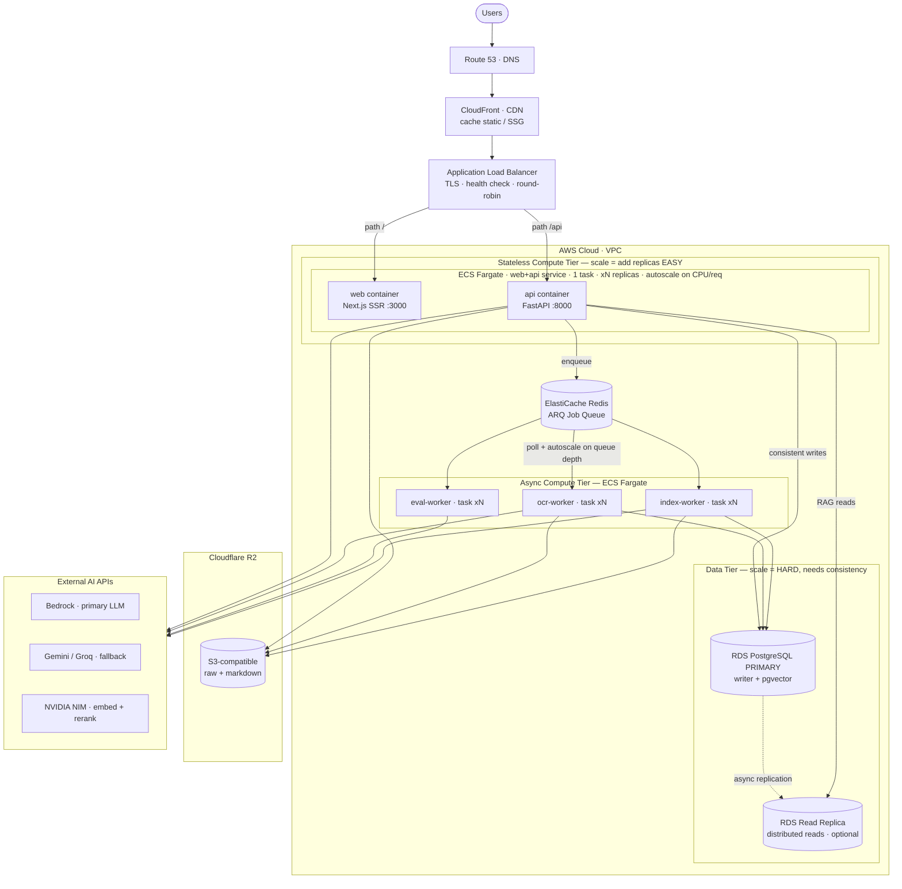

# Deployment Architecture

## Notes

The diagram makes three points explicit:

1. **Edge.** Route 53 → CloudFront → ALB is the single entry point. The ALB
   spreads traffic across replicas with health checks and TLS termination.
2. **Compute scales easily.** The web and API containers are co-located in one
   stateless ECS Fargate task (a single load balancer routes `/`→web and `/api`→api
   to the two ports on the same task); the three workers are separate stateless
   services. They scale horizontally by adding tasks — the web+api task on
   CPU/request load (replicating the pair together), each worker independently on
   Redis queue depth (a CloudWatch custom metric driving Application Auto Scaling).
3. **Data is the hard part.** A single RDS PostgreSQL **primary** is the writer and
   the consistency anchor (`pgvector` lives here). Read replicas absorb RAG read
   traffic (distributed reads, asynchronous replication). True distributed *writes*
   would require Aurora / sharding and are out of scope for this thesis.
