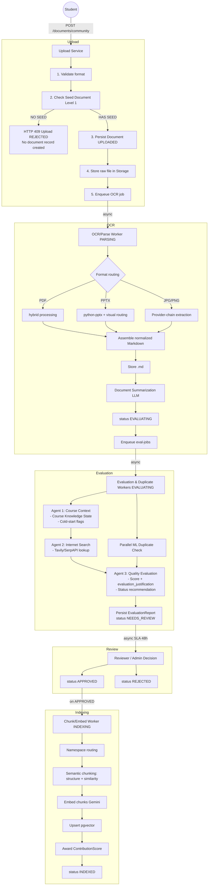

# Community Contribution Upload & Evaluation Flow

```mermaid
flowchart TD
    Student((Student))
    UploadService[Upload Service]
    Student -->|POST /documents/community| UploadService
    
    subgraph Upload
        UploadService --> Val1[1. Validate format]
        Val1 --> Val2[2. Check Seed Document Level 1]
        Val2 -->|NO SEED| REJ[HTTP 409 Upload REJECTED\nNo document record created]
        Val2 -->|HAS SEED| Val3[3. Persist Document UPLOADED]
        Val3 --> Val4[4. Store raw file in Storage]
        Val4 --> Val5[5. Enqueue OCR job]
    end
    
    OCRWorker[OCR/Parse Worker PARSING]
    Val5 -->|async| OCRWorker
    
    subgraph OCR
        OCRWorker --> FormatRouting{Format routing}
        FormatRouting -->|PDF| PDF[hybrid processing]
        FormatRouting -->|PPTX| PPTX[python-pptx + visual routing]
        FormatRouting -->|JPG/PNG| Image[Provider-chain extraction]
        
        PDF --> Markdown[Assemble normalized Markdown]
        PPTX --> Markdown
        Image --> Markdown
        
        Markdown --> Store[Store .md]
        Store --> Sum[Document Summarization LLM]
        Sum --> EvalState[status EVALUATING]
        EvalState --> EnqEval[Enqueue eval-jobs]
    end
    
    EvalWorker[Evaluation & Duplicate Workers EVALUATING]
    EnqEval -->|async| EvalWorker
    
    subgraph Evaluation
        EvalWorker --> DUP_CHECK[Parallel ML Duplicate Check]
        EvalWorker --> Agent1[Agent 1: Course Context\n- Course Knowledge State\n- Cold-start flags]
        Agent1 --> Agent2[Agent 2: Internet Search\n- Tavily/SerpAPI lookup]
        Agent2 --> Agent3[Agent 3: Quality Evaluation\n- Score + evaluation_justification\n- Status recommendation]
        DUP_CHECK --> Agent3
        Agent3 --> Report[Persist EvaluationReport\nstatus NEEDS_REVIEW]
    end
    
    ReviewDecision[Reviewer / Admin Decision]
    Report -->|async SLA 48h| ReviewDecision
    
    subgraph Review
        ReviewDecision --> Approve[status APPROVED]
        ReviewDecision --> Reject[status REJECTED]
    end
    
    ChunkWorker[Chunk/Embed Worker INDEXING]
    Approve -->|on APPROVED| ChunkWorker
    
    subgraph Indexing
        ChunkWorker --> Route[Namespace routing]
        Route --> SemChunk[Semantic chunking: structure + similarity]
        SemChunk --> Embed[Embed chunks Gemini]
        Embed --> Upsert[Upsert pgvector]
        Upsert --> Points[Award ContributionScore]
        Points --> Indexed[status INDEXED]
    end
```
