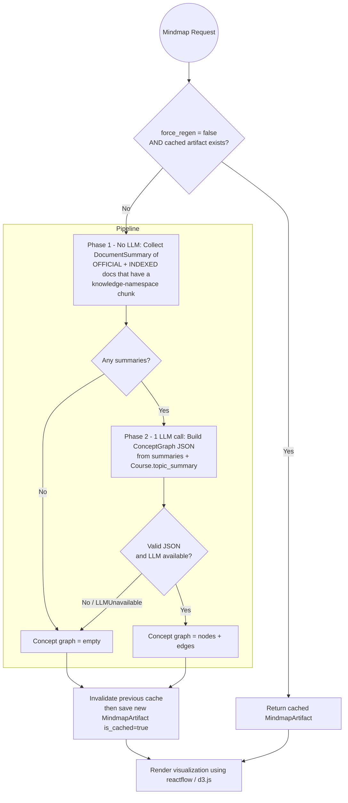

# Mindmap Generation Flow (Single-Pass with Cache)

> Note: the iterative per-topic deep-dive (RAG retrieval + sub-concept merge)
> described in the system design is not part of the current prototype; the
> concept graph is produced in a single LLM call over the collected summaries.
