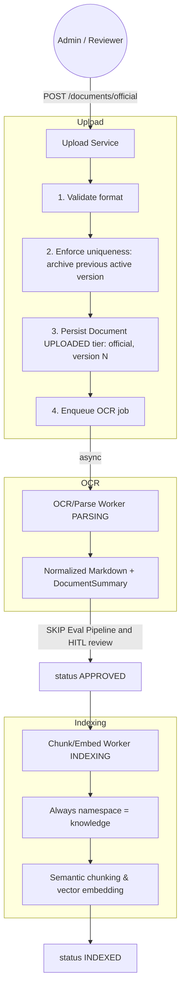

# Official Material Upload Flow (Tier 1 — Shortcut Path)

```mermaid
flowchart TD
    Admin(("Admin / Reviewer"))
    UploadService["Upload Service"]
    
    Admin -->|"POST /documents/official"| UploadService
    
    subgraph Upload
        UploadService --> V["1. Validate format"]
        V --> E["2. Enforce uniqueness: archive previous active version"]
        E --> P["3. Persist Document UPLOADED tier: official, version N"]
        P --> C["4. Enqueue OCR job"]
    end
    
    C -->|"async"| OCRWorker["OCR/Parse Worker PARSING"]
    
    subgraph OCR
        OCRWorker --> MD["Normalized Markdown + DocumentSummary"]
    end
    
    MD -->|"SKIP Eval Pipeline and HITL review"| Apprv["status APPROVED"]
    
    Apprv --> Index["Chunk/Embed Worker INDEXING"]
    
    subgraph Indexing
        Index --> Scope["Always namespace = knowledge"]
        Scope --> Sem["Semantic chunking & vector embedding"]
    end
    
    Sem --> Fin["status INDEXED"]
```
