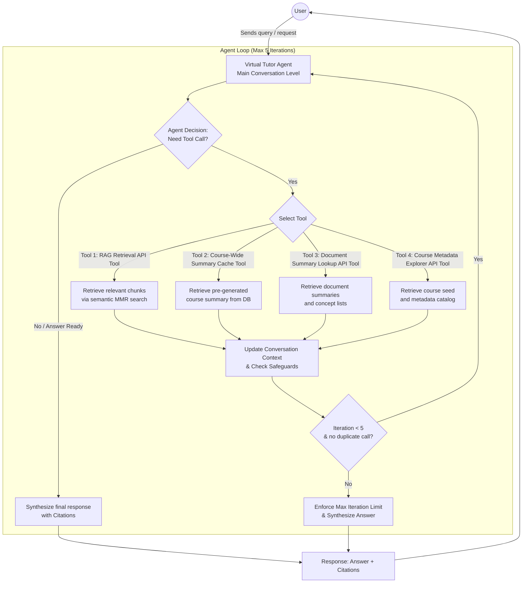

# Virtual Tutor (RAG) Query & Summarization Flow

```mermaid
flowchart TD
    User((User)) -->|Sends query / request| Agent[Virtual Tutor Agent<br/>Main Conversation Level]
    
    subgraph LoopSection ["Agent Loop (Max 5 Iterations)"]
        Agent --> Decision{Agent Decision:<br/>Need Tool Call?}
        Decision -->|Yes| ToolSelect{Select Tool}
        
        ToolSelect -->|Tool 1: RAG Retrieval API Tool| RAG[Retrieve relevant chunks<br/>via semantic MMR search]
        ToolSelect -->|Tool 2: Course-Wide Summary Cache Tool| Cache[Retrieve pre-generated<br/>course summary from DB]
        ToolSelect -->|Tool 3: Document Summary Lookup API Tool| DocSum[Retrieve document summaries<br/>and concept lists]
        ToolSelect -->|Tool 4: Course Metadata Explorer API Tool| Meta[Retrieve course seed<br/>and metadata catalog]
        
        RAG --> Update[Update Conversation Context<br/>& Check Safeguards]
        Cache --> Update
        DocSum --> Update
        Meta --> Update
        
        Update --> LoopCheck{Iteration < 5<br/>& no duplicate call?}
        LoopCheck -->|Yes| Agent
        LoopCheck -->|No| MaxLimit[Enforce Max Iteration Limit<br/>& Synthesize Answer]
        
        Decision -->|No / Answer Ready| Direct[Synthesize final response<br/>with Citations]
    end
    
    Direct --> Resp[Response: Answer + Citations]
    MaxLimit --> Resp
    Resp --> User
```

