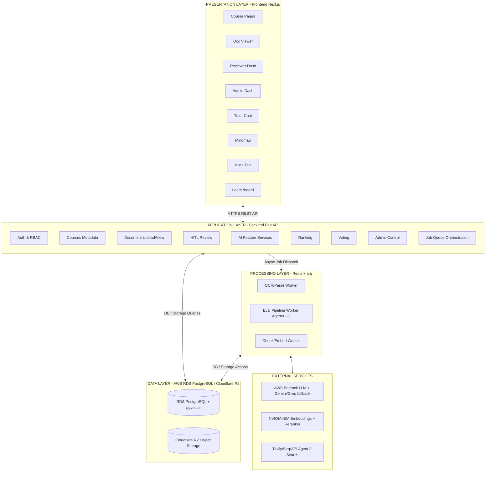

# High-Level System Architecture

```mermaid
flowchart TD
    subgraph Presentation_Layer [PRESENTATION LAYER - Frontend Next.js]
        CP[Course Pages]
        DV[Doc Viewer]
        RD[Reviewer Dash]
        AD[Admin Dash]
        TC[Tutor Chat]
        MM[Mindmap]
        MT[Mock Test]
        LB[Leaderboard]
    end

    subgraph Application_Layer [APPLICATION LAYER - Backend FastAPI]
        direction TB
        Auth[Auth & RBAC]
        CM[Courses Metadata]
        Doc[Document Upload/View]
        HITL[HITL Review]
        AI[AI Feature Services]
        Rank[Ranking]
        Vote[Voting]
        Admin[Admin Control]
        Job[Job Queue Orchestration]
    end

    subgraph Processing_Layer [PROCESSING LAYER - Redis + arq]
        OCR[OCR/Parse Worker]
        Eval[Eval Pipeline Worker Agents 1-3]
        Chunk[Chunk/Embed Worker]
    end

    subgraph Data_Layer [DATA LAYER - AWS RDS PostgreSQL / Cloudflare R2]
        DB[(RDS PostgreSQL + pgvector)]
        Storage[(Cloudflare R2 Object Storage)]
    end

    subgraph External_Services [EXTERNAL SERVICES]
        Providers[AWS Bedrock LLM + Gemini/Groq fallback]
        Embed[NVIDIA NIM Embeddings + Reranker]
        Search[Tavily/SerpAPI Agent 2 Search]
    end

    Presentation_Layer <-->|HTTPS REST API| Application_Layer
    Application_Layer -->|Async Job Dispatch| Processing_Layer
    Application_Layer <-->|DB / Storage Queries| Data_Layer
    Processing_Layer <-->|DB / Storage Actions| Data_Layer
    Processing_Layer <--> External_Services
```
